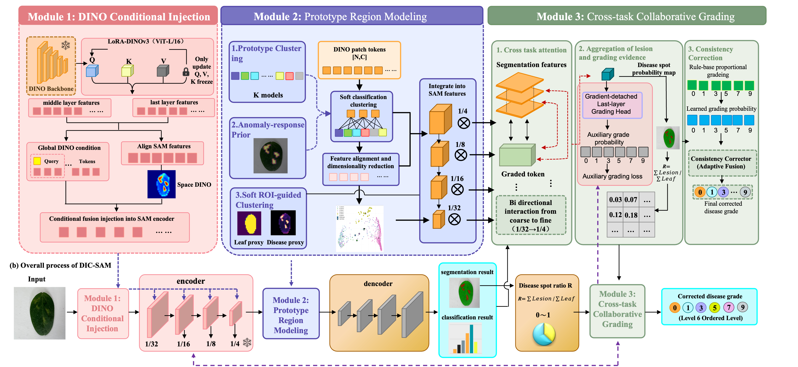

# DIC-SAM

DIC-SAM is a collaborative image segmentation and grading project built on SAM3 and DINOv3.



## Requirements

- OS: Linux / Ubuntu recommended
- Python: 3.12
- Conda: Anaconda or Miniconda
- GPU: CUDA 12.8 or a higher CUDA-compatible version
- Dependency file: `requirements.txt`

## Create the Conda Environment

```bash
conda create -n DIC-SAM python=3.12
conda deactivate
conda activate DIC-SAM
```

## Install PyTorch

Use the PyTorch wheel index for CUDA 12.8:

```bash
pip install torch torchvision --index-url https://download.pytorch.org/whl/cu128
```

You can verify CUDA after installation:

```bash
python -c "import torch; print(torch.__version__); print(torch.cuda.is_available()); print(torch.version.cuda)"
```

## Install SAM3

If `sam3/` is not already present in the project root, clone the official SAM3 repository:

```bash
git clone https://github.com/facebookresearch/sam3.git
```

Then install it in editable mode:

```bash
cd sam3
pip install -e .
cd ..
```

## Install DINOv3

Clone the official [facebookresearch/dinov3.git](https://github.com/facebookresearch/dinov3.git) repository into `./dinov3/`, just like SAM3:

```bash
git clone https://github.com/facebookresearch/dinov3.git
```

## Install Project Dependencies

Back in the DIC-SAM project root, install the remaining dependencies:

```bash
pip install -r requirements.txt
```

## Data Layout

Place the dataset under the `data/` directory at the project root:

```text
DIC-SAM/
└── data/
    ├── annotations/
    └── images/
```

## Project Structure

```text
DIC-SAM/
├── ckpt/                 # DINOv3 pre-trained weights
├── data/                 # Data directory
│   ├── annotations/
│   └── images/
├── dinov3/               # DINOv3 code
├── load/                 # SAM3 weights and loader files
├── model/                # Model definitions
├── sam3/                 # SAM3 official code
├── train/                # Training code
├── ablation_slurm_ddp.sh # Multi-GPU SLURM training script
├── dataset.py            # Dataset loading script
├── requirements.txt      # Python dependency list
└── README.md             # English project documentation
```

## Multi-GPU SLURM Training

On a multi-GPU SLURM cluster, you can launch experiments with the `ablation_slurm_ddp.sh` script:

```bash
sbatch ablation_slurm_ddp.sh
```

The script starts DDP training with `torchrun` and configures GPU allocation, training arguments, DINOv3 weights, SAM3 weights, and data paths. Before use, adjust the `#SBATCH` settings, Conda path, project path, and GPU count to match your cluster.

## Quick Setup

```bash
conda create -n DIC-SAM python=3.12
conda deactivate
conda activate DIC-SAM

pip install torch torchvision --index-url https://download.pytorch.org/whl/cu128

git clone https://github.com/facebookresearch/sam3.git
cd sam3
pip install -e .
cd ..

git clone https://github.com/facebookresearch/dinov3.git

pip install -r requirements.txt
```

## Notes

- Make sure your NVIDIA driver is compatible with CUDA 12.8 or higher.
- Run `pip install -r requirements.txt` from the project root.
- If `sam3/` already exists, you do not need to clone it again.
- Keep the `annotations/` and `images/` directory names unchanged under `data/`.

## Acknowledgements

- [facebookresearch/sam3](https://github.com/facebookresearch/sam3)
- [facebookresearch/dinov3](https://github.com/facebookresearch/dinov3)
